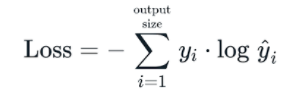
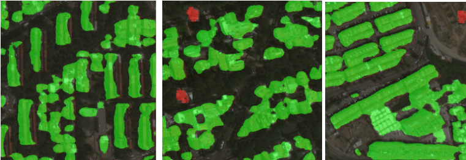

# Disaster Management Toolkit
An application that can perform online disaster assessment


<div id="top"></div>
<!--
*** Thanks for checking out the Best-README-Template. If you have a suggestion
*** that would make this better, please fork the repo and create a pull request
*** or simply open an issue with the tag "enhancement".
*** Don't forget to give the project a star!
*** Thanks again! Now go create something AMAZING! :D
-->


<!-- PROJECT SHIELDS -->
<!--
*** I'm using markdown "reference style" links for readability.
*** Reference links are enclosed in brackets [ ] instead of parentheses ( ).
*** See the bottom of this document for the declaration of the reference variables
*** for contributors-url, forks-url, etc. This is an optional, concise syntax you may use.
*** https://www.markdownguide.org/basic-syntax/#reference-style-links
-->
[![Contributors][contributors-shield]][contributors-url]
[![Forks][forks-shield]][forks-url]
[![Stargazers][stars-shield]][stars-url]
[![Issues][issues-shield]][issues-url]


## Project Organization
-------
    ├── README.md       
    │   
    ├── disaster-assessment-app                
    |
    ├── backend         <- Deep Learning Model      
    │   ├── helper_earthquake.py
    │   ├── helper_forest_fire.py
    │   └── MRA_Model.py
    │   └── predict_earthquake.py
    |   └── predict_forest_fire.py
    │   ├── checkpoint <- Saved Models
    │   ├── model_latest.ckpt.data-00000-of-00001
    │   ├── model_latest.ckpt.index
    │   └── model_latest.ckpt.meta
    ├── src
    │   └── metrics.py
    │   ├── Augment_Data.py     <- Main data augmentation file
    │   ├── cap_aug.py          <- File for cut paste augmentation
    │
    │                              
    ├── public                 
    └── data
        ├── vgg
        │   ├── variables
        │   ├── make_dataset.py  <- Script to generate data
                └── ....
        


<!-- ABOUT THE PROJECT -->
## About The Project
-------

The purpose of this hack is to aid in the real-time and rapid disaster identification and alleviation by promptly identifying the degree of damaged buildings and areas using remotely sensed images (satellite images) and also provides online updates of earthquakes and fires on the basis of the current scenario on the field.


Segmentation of remotely sensed images lies at the intersection of the domains of remote sensing and computer vision. It is used to systematically extract information from data collected by various airborne and space-borne sensors, resulting in a simpler representation. This method is used in various applications which include change detection, land cover and land use classification, resource exploration, the study of natural hazards, and mapping. In this work, we will focus on the study of natural hazards, i.e., building a multi-class semantic segmentation model that categories the given post-disaster (earthquakes in particular) imagery based on damage. 

The model is trained on the Xview2 building damage assessment dataset.

# Network
-------

For the given task we propose to go with the traditional U-Net architecture composed with an MRA (Multi-Resolution Analysis ) framework. The U-Net architecture is a simple encoder-decoder fully convolutional pipeline consisting of contracting (encoder) and expanding/extracting (decoder) paths. 
The MRA framework is interspersed into the U-Net Architecture in such a way that it pre-processes the inputs to the network at several stages to increase the contextual overview of the network as the same data on multiple scales is available for feature extraction and learning. 


## Why MRA? 
-------

The intuition behind using multi-resolution analysis is that images contain features at different scales important for segmentation, therefore, a multi-resolution analysis (MRA) approach is useful for their extraction since this decomposition allows us to even segment structures of various dimensions and structures with ease.


## Network Architecture
-------

<p align="center">
  
</p>

## Loss Function
-------

Categorical cross-entropy was used as the loss function

<p align="center">
  
</p>

## Dataset
-------

Please Download the Xview2 Earthquake disaster Dataset and save the Images and Labels_json in dataset. Create the groundtruth masks from the json file using Labels_Generate.py and save the labels in folder Labels.


### Setup
-------

1. Install the [virtualenv tool](https://pypi.org/project/virtualenv-tools/)
2. Create env
   ```
    python -m venv <env-name>
   ```
3. Activate env
   ```sh
   source <env-name>/bin/activate
   ```
4. ```sh
   pip install -r requirements.txt
   ```
5. Loading data <br>( Download data.zip from the [here](https://drive.google.com/drive/u/1/folders/1rNZOSgXUMRIO5JUhLPWkwlid3cD-irot) and extract in home folder )
6. Saved Models <br>
   To test the model download saved_models.zip from [here](https://drive.google.com/drive/u/1/folders/1rNZOSgXUMRIO5JUhLPWkwlid3cD-irot) and extract in home folder
7. Installing wavetf <br>
    ```sh
       cd wavetf
       pip3 install .
   ```
<p align="right">(<a href="#top">back to top</a>)</p>


## Run
-------

```

```

## Results

<p align="center">
  
</p>

meanIOU:       88.17% <br>
meanDice:      92.55% <br>
pixelAccuracy: 89.9% <br>
Precision:     90.27% <br>
Recall:        92.98% <br>


<!-- LICENSE -->
## License

Distributed under the GNU License. See `LICENSE.txt` for more information.

<p align="right">(<a href="#top">back to top</a>)</p>


<!-- MARKDOWN LINKS & IMAGES -->
